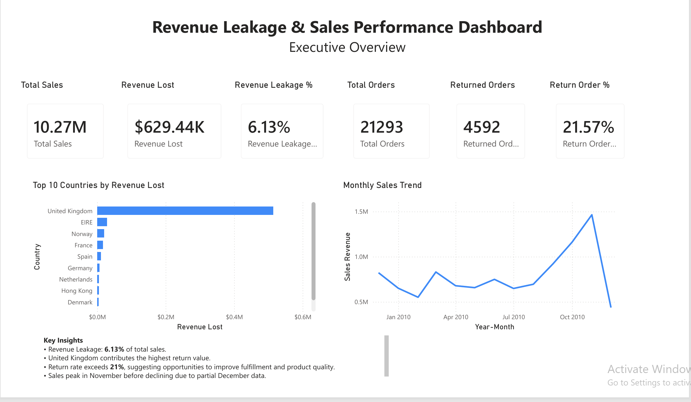
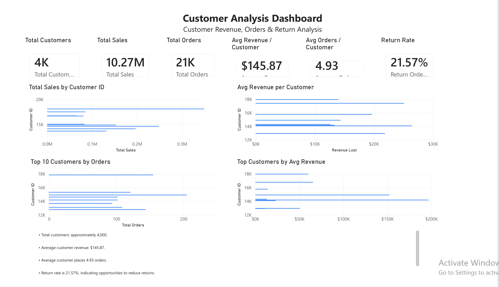
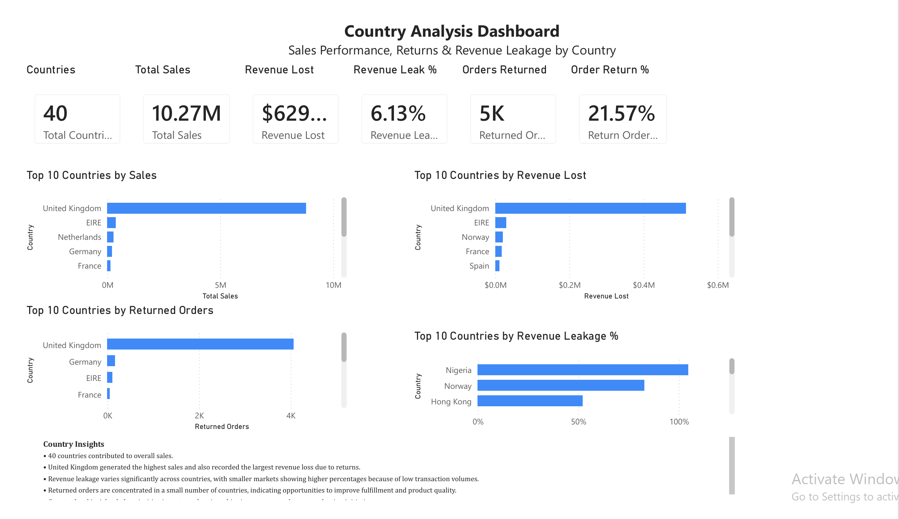
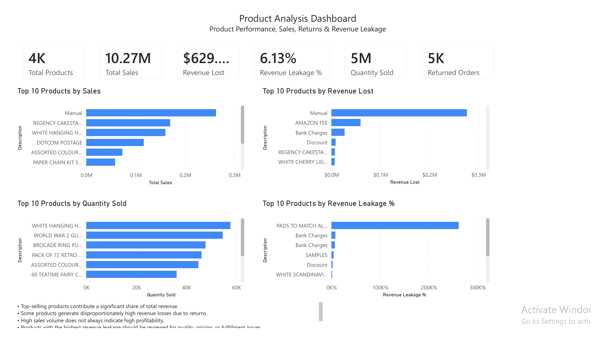

# 📊 Revenue Leakage Analysis

An end-to-end Data Analytics project that uncovers revenue leakage, customer behavior, sales performance, product performance, and return trends using Python, SQL, SQLite, and Microsoft Power BI.

---

## 📌 Project Overview

Revenue leakage silently reduces profitability through product returns, discounts, cancellations, pricing issues, and operational inefficiencies.

This project analyzes an online retail dataset to identify:

- Revenue leakage
- Customer purchasing behaviour
- Product performance
- Country-wise sales trends
- Sales KPIs
- Business opportunities

The project demonstrates the complete analytics workflow from raw data to executive dashboards.

---

## 🚀 Tech Stack

- Python
- Pandas
- NumPy
- SQL
- SQLite
- Jupyter Notebook
- Power BI
- Git
- GitHub

---

## 📂 Project Structure

```
Revenue-Leakage-Analysis/
│
├── dashboard/
│   └── Revenue_Leakage.pbix
│
├── data/
│   ├── raw/
│   └── cleaned/
│
├── notebooks/
│   ├── 01_data_understanding.ipynb
│   ├── 02_data_cleaning.ipynb
│   ├── 03_feature_engineering.ipynb
│   ├── 04_exploratory_analysis.ipynb
│   └── 05_cohort_analysis.ipynb
│
├── reports/
│
├── sql/
│
├── requirements.txt
└── README.md
```

---

# 📊 Dashboard Pages

## Executive Dashboard

Provides an executive summary of the business including:

- Total Revenue
- Revenue Leakage
- Orders
- Customers
- Products
- Return Rate
- Monthly Sales Trend

---

## Customer Analysis

Analyzes customer purchasing behaviour.

Includes:

- Top Customers by Sales
- Revenue Lost by Customer
- Average Revenue per Customer
- Average Orders per Customer
- Customer Return Rate

---

## Country Analysis

Shows geographical performance.

Includes:

- Top Countries by Sales
- Revenue Leakage by Country
- Returned Orders
- Revenue Leakage %
- Country Insights

---

## Product Analysis

Measures product performance.

Includes:

- Top Selling Products
- Highest Revenue Loss Products
- Quantity Sold
- Product Revenue Leakage %
- Product Insights

---

# 📈 Key KPIs

- Total Sales
- Revenue Lost
- Revenue Leakage %
- Total Customers
- Total Orders
- Returned Orders
- Average Revenue per Customer
- Average Orders per Customer
- Quantity Sold

---

# 🧠 Business Insights

Some key findings include:

- A small number of customers generate a significant share of revenue.
- Product returns contribute substantially to revenue leakage.
- Certain countries contribute disproportionately to returned orders.
- High-selling products are not always the most profitable.
- Revenue leakage can be reduced through improved return management and pricing strategies.

---

# 💻 SQL Analysis

SQL scripts include:

- Executive KPIs
- Customer Analysis
- Country Analysis
- Product Analysis
- Revenue Leakage Analysis
- Time-based Analysis
- Advanced SQL Queries

---

# 📷 Dashboard Preview

## Executive Dashboard



---

## Customer Analysis Dashboard



---

## Country Analysis Dashboard



---

## Product Analysis Dashboard



---

# ▶️ How to Run

Clone the repository

```bash
git clone https://github.com/yourusername/Revenue-Leakage-Analysis.git
```

Install dependencies

```bash
pip install -r requirements.txt
```

Open the notebooks or Power BI dashboard.

---

# 📚 Skills Demonstrated

- Data Cleaning
- Exploratory Data Analysis
- Feature Engineering
- SQL Analytics
- KPI Development
- Business Intelligence
- Data Visualization
- Dashboard Design
- Business Storytelling

---

# 👤 Author

**Prabudha Darabare**

Data Analyst | Prompt Engineer | AI-Assisted Analytics

GitHub:
https://github.com/Prabudha-start